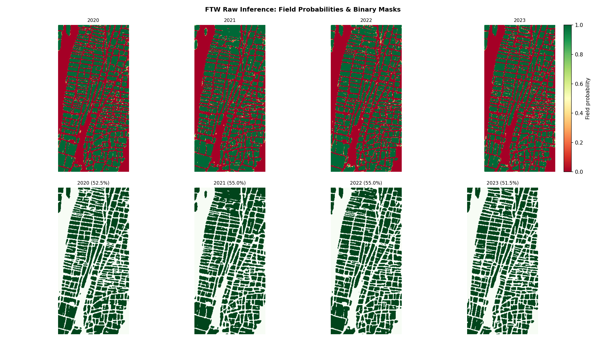
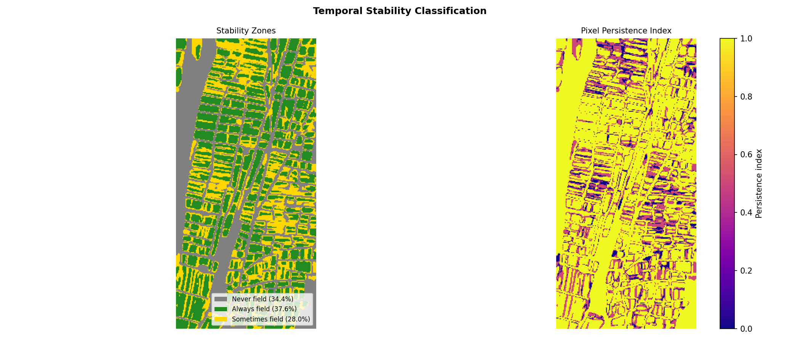

# Pheno-Boundary Detection using FTW

Agricultural field delineation and temporal stability analysis over South Tyrol, Italy, using FTW (Fields of the World) U-Net + EfficientNet-B3 model. The pipeline runs on Sentinel-2 bi-temporal composites (spring + summer) across four years (2020–2023).

---

## Data & Model

**Imagery**
- Sentinel-2 L2A, accessed via EOPF STAC (`stac.core.eopf.eodc.eu`)
- 4 years × 2 seasonal composites (spring / summer), bands B02 B03 B04 B08 at 10 m resolution
- Study area: South Tyrol, Italy — `[11.2908, 46.3565, 11.3151, 46.3890]` (EPSG:4326)

**Ground truth**
- South Tyrol cadastral parcel shapefile for pixel-level and boundary-level validation

---
## How to Re-Run this notebook

Copy this whole repo in your google drive directly `MyDrive/Pheno_boundary_detection_FTW` then execute the python notebook in colab with GPU toggled.

---
## Results

**Inference Result Using BBox**

**Stability Zones**

**Pixel-level validation** vs. cadastral parcels

| Year | Precision | Recall | F1 |
|------|-----------|--------|----|
| 2020 | 0.9782 | 0.5234 | 0.6819 | 
| 2021 | 0.9786 | 0.5542 | 0.7076 |
| 2022 | 0.9806 | 0.5546 | 0.7085 |
| 2023 | 0.9782 | 0.5178 | 0.6772 |

## Interactive Map

Download this [map file](data/outputs/interactive_map.html) and view it locally in your browser

