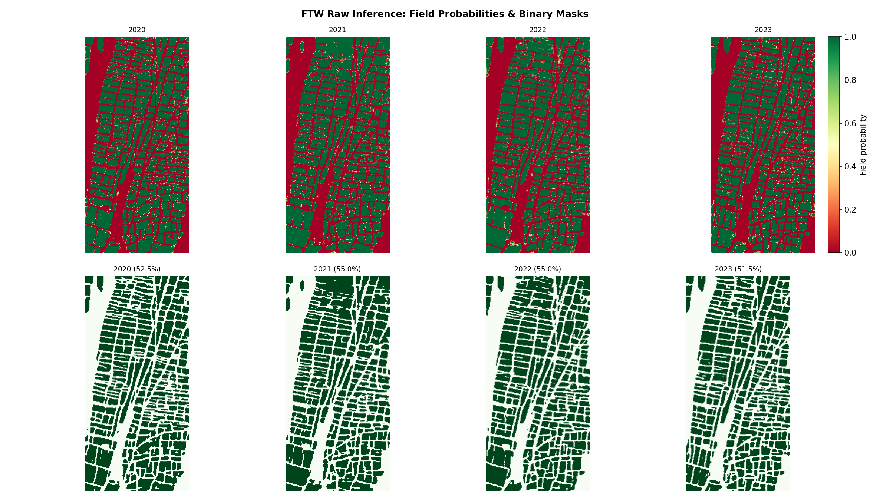
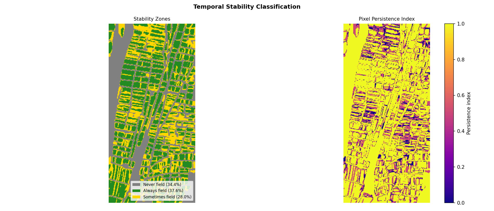

# Pheno-Boundary Detection using FTW

Agricultural field delineation and temporal stability analysis over South Tyrol, Italy, using FTW (Fields of the World) U-Net + EfficientNet-B3 model. The pipeline runs on Sentinel-2 bi-temporal composites (spring + summer) across four years (2020–2023).

---

## Data & Model

**Imagery**
- Sentinel-2 L2A, accessed via EOPF STAC (`stac.core.eopf.eodc.eu`)
- 4 years × 2 seasonal composites (spring / summer), bands B02 B03 B04 B08 at 10 m resolution
- Study area: South Tyrol, Italy — `[11.2908, 46.3565, 11.3151, 46.3890]` (EPSG:4326)


**Ground truth**
- South Tyrol cadastral parcel shapefile for pixel-level and boundary-level validation

---

## Pipeline

The work is split into a small `src/` package, one module per stage:

1. **Data access** (`data_loader.py`) — connects to the EOPF STAC catalog, searches Sentinel-2 L2A scenes over the AOI, reprojects the bounding box to UTM (EPSG:32632), and builds a multi-temporal datacube straight from Zarr (parallelized with Dask).
2. **Preprocessing** (`preprocessing.py`) — masks clouds and shadows with the Scene Classification Layer, builds seasonal median composites, and stacks them into the 8-channel bi-temporal input FTW expects (spring + summer, 4 bands each), normalized to [0, 1].
3. **Inference** (`inference.py`) — runs the FTW U-Net (EfficientNet-B3 encoder, 8-channel input, 3 classes: non-field / field / boundary) over each year using overlapping 256-pixel tiles that are averaged back together.
4. **Post-processing** (`postprocessing.py`) — cleans the raw prediction with a VITO-style segmentation (Sobel edges → Felzenszwalb superpixels → region-adjacency-graph merge → per-segment voting) to get smooth, region-consistent parcels.
5. **Stability analysis** (`stability.py`) — compares the yearly masks with IoU, detects field gain and loss between consecutive years, and labels each pixel as always / never / sometimes field.
6. **Validation** (`validation.py`) — scores the predictions against the cadastral parcels at pixel, boundary, and per-parcel level (precision, recall, F1).
7. **Vectorization & map** (`vectorization.py`) — picks the most temporally stable year, converts its segments into polygons, and builds the interactive map overlaying predicted parcels on the cadastre.

`visualization.py` holds the plotting helpers used across these stages.

---

## Repository Structure

```
Pheno_boundary_detection_FTW/
├── Pheno_boundary_FTW.ipynb   # Driver notebook — runs the full pipeline
├── src/                       # Pipeline package (one module per stage)
│   ├── data_loader.py
│   ├── preprocessing.py
│   ├── inference.py
│   ├── postprocessing.py
│   ├── stability.py
│   ├── validation.py
│   ├── vectorization.py
│   └── visualization.py
├── model/                     # FTW EfficientNet-B3 checkpoint (.ckpt)
├── data/
│   ├── South_Tyrol_parcels.*  # Cadastral ground-truth parcels
│   └── outputs/               # Figures, metrics (CSV), parcel GeoJSONs, interactive map
└── requirements.txt
```

---

## How to Re-Run this notebook

Copy this whole repo in your google drive directly `MyDrive/Pheno_boundary_detection_FTW` then execute the python notebook in colab with GPU toggled.

---
## Results

**Inference Result Using BBox**


**Stability Zones**



**Pixel-level validation** vs. cadastral parcels

| Year | Precision | Recall | F1 |
|------|-----------|--------|----|
| 2020 | 0.9782 | 0.5234 | 0.6819 | 
| 2021 | 0.9786 | 0.5542 | 0.7076 |
| 2022 | 0.9806 | 0.5546 | 0.7085 |
| 2023 | 0.9782 | 0.5178 | 0.6772 |


## Interactive Map

Download this [map file](data/outputs/interactive_map.html) and view it locally in your browser

